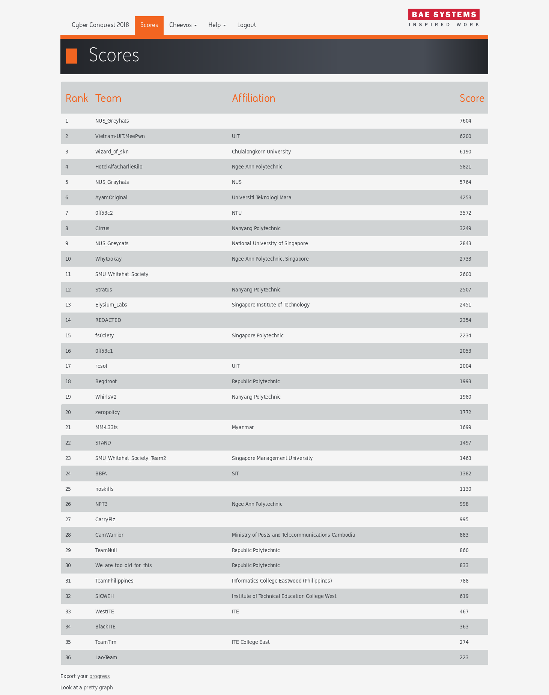
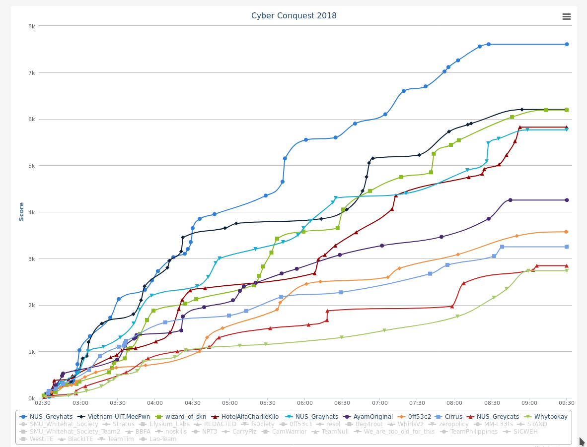

# Singapore Cyber Conquest 2018

Here is questions that I was able to save a day after competing.
Some questions that aren't savable (such as web or service challenge) has been omitted.

`readme.txt` contains description of the questions, including hints (if available) for the question. If you  want to avoid spoiling yourself, assume that it doesn't exist. ;D

Have fun!

psst: I'm from AyamOriginal team. 👋

## Scoreboard

## Timeline

