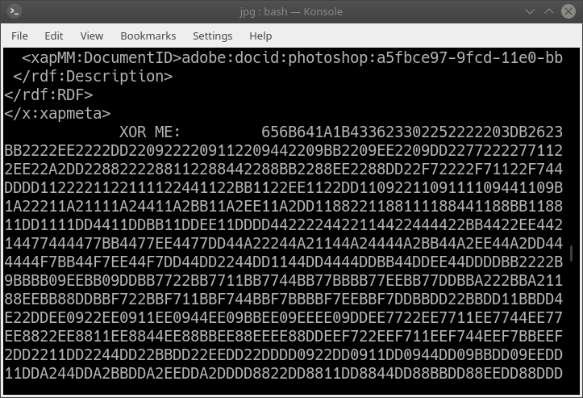

## Pwnable Data Format

**Category :** Forensics

**Points :** 400

**Solves :** -

**Description :**
Find the key

**Hint :** 
- 10 point hint: Find some tools which let you explore PDFs, or just carve out files.
- 10 point hint: If you're not sure what to XOR with, try everything!

### Write-up

Upon getting the PDF file, `foremost` and then out additional `.jpg` file came out.  

Looking plainly at `.jpg` doesn't have anything. Tried with `stegsolve` also come out with nothing.  

Tried to `strings`, this came out:  

So, it said `XOR ME`. Tried to XOR brute force with [CyberChef](https://gchq.github.io/CyberChef/) doesn't came out anything.  

So, I wrote a python script, which "might be" the XOR is originally a file.

`
import os

with open("hex", 'rb') as fi:
    h = list(fi.read())
    for k in range(255):
        hn = [k^e for e in h]
        with open("out", 'wb') as fo:
            fo.write(bytearray(hn))
        out = os.popen('file out').read()
        if 'out: data' not in out:
            print("key = 0x%x" % k)
            os.system("cp out out_{}".format(k))
`

Output:

`
key = 0x22, signature = out: GIF image data, version 89a, 276 x 18
key = 0x7f, signature = out: ARC+ archive data
key = 0x9a, signature = out: MPEG ADTS, AAC, v4 LTP, stereo
key = 0xdd, signature = out: COM executable for DOS
key = 0xe9, signature = out: DOS executable (COM, 0x8C-variant)
key = 0xf0, signature = out: PGP\011Secret Key -
key = 0xf2, signature = out: PGP\011Secret Sub-key -
`

So all these keys output some good files, looking at file manager, then key `0x22` with `GIF` file have the aforementioned flag.

`Your secret is safe with me`
