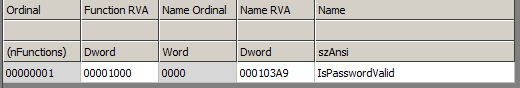
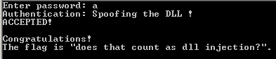
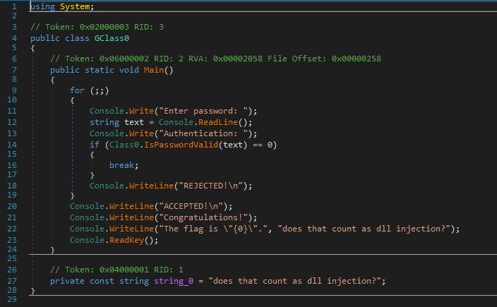

## Local Validation

**Category :** Binary

**Points :** 400

**Solves :** -

**Description :**
Get the flag

**Hint :** 
- 5 point hint: You don't need to understand how either of the files work, just the interaction between them.
- 20 point hint: Create your own DLL that exports an IsPasswordValid() function, and attempt to get the function signature correct.
### Write-up

This challenge consist of 3 files
- FlagPrinter.cs <- source code for the provided executable
- FlagPrinter.exe <- the executable
- PasswordValidation.dll <- the dll for password checker

Upon opening `FlagPrinter.exe`, it prompt for password, when we entering random pass, we got `REJECTED` .


Further inspecting all three files
- FlagPrinter.cs <- we can get idea how the executable verify password and flag is located here
- FlagPrinter.exe <- .NET executable with ConfuserEx protection 
- PasswordValidation.dll <- normal dll without any packer/protection

so basically from the source code provided we need to get `return 0` from `PasswordValidation.dll` to print our flag in `FlagPrinter.exe`
```csharp
<-snip->
                // validate it using the secure authentication library
                Console.Write("Authentication: ");
                if (NativeMethods.IsPasswordValid(password) == 0)
                {
                    // the password was authenticated successfully
                    Console.WriteLine("ACCEPTED!\n");
                    break;
                }

                // the password was rejected
                Console.WriteLine("REJECTED!\n");
            }

            Console.WriteLine("Congratulations!");
            Console.WriteLine("The flag is \"{0}\".", Flag);
            Console.ReadKey();  // don't quit until after a key is pressed
<-snip->
```

why don't we just decompile the `FlagPrinter.exe` and get the flag in there?

Because that is not the author intention for us to solve this question.

There is no dll integrity check on `Flagprinter.exe` , so we can load our own `PasswordValidation.dll` that `return 0` upon called by `Flagprinter.exe`

Checking the dll for its export name `IsPasswordValid`



Now we can code our dll that have the export and `return 0` to the `FlagPrinter.exe`
below is our sample code, you can code it any way you want.

```cpp
#include "stdafx.h"
#include <stdio.h>
extern "C"
{

	__declspec(dllexport) int IsPasswordValid(char *Str)
	{
		int result = 0;
		printf ("Spoofing the DLL !\n");
		return result;
	}
}
```
replace the original dll with our dll and run the `FlagPrinter.exe`



Flag : does that count as dll injection?

**Notes**

You also can deobfuscate the `FlagPrinter.exe` using de4dot and get the flag. which is easier.

