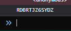

## omghax

**Category :** Reverse Engineering

**Points :** 400

**Solves :** -

**Description :**
We've been hacked! We think the hackers left a backdoor though.

**Hint :** 
- 20 point hint: There are different ways of accessing properties in Javascript - http://www.w3schools.com/js/js_properties.asp

### Write-up
Here the source code which look obfuscated enough, lets beautify it first.
```html
<html><head>
<meta http-equiv="content-type" content="text/html; charset=windows-1252"> 
<style>
    body { background-color: black; font-family:courier; color: white;}
</style>
<script id="trolololol" type="text/javascript">
var _0x39e8=["","\x64\x65\x76\x74\x6F\x6F\x6C\x73\x63\x68\x61\x6E\x67\x65","\x64\x69\x73\x70\x61\x74\x63\x68\x45\x76\x65\x6E\x74","\x46\x69\x72\x65\x62\x75\x67","\x63\x68\x72\x6F\x6D\x65","\x69\x73\x49\x6E\x69\x74\x69\x61\x6C\x69\x7A\x65\x64","\x6F\x75\x74\x65\x72\x57\x69\x64\x74\x68","\x69\x6E\x6E\x65\x72\x57\x69\x64\x74\x68","\x6F\x75\x74\x65\x72\x48\x65\x69\x67\x68\x74","\x69\x6E\x6E\x65\x72\x48\x65\x69\x67\x68\x74","\x6F\x70\x65\x6E","\x75\x6E\x64\x65\x66\x69\x6E\x65\x64","\x65\x78\x70\x6F\x72\x74\x73","\x64\x65\x76\x74\x6F\x6F\x6C\x73","\x6C\x6F\x63\x61\x74\x69\x6F\x6E","\x68\x74\x74\x70\x3A\x2F\x2F\x77\x77\x77\x2E\x67\x6F\x6F\x67\x6C\x65\x2E\x63\x6F\x6D\x2F","\x61\x64\x64\x45\x76\x65\x6E\x74\x4C\x69\x73\x74\x65\x6E\x65\x72","\x41\x42\x43\x44\x45\x46\x47\x48\x49\x4A\x4B\x4C\x4D\x4E\x4F\x50\x51\x52\x53\x55\x54\x56\x57\x58\x59\x5A\x30\x31\x32\x33\x34\x35\x36\x37\x38\x39","\x70\x75\x73\x68","\x6C\x65\x6E\x67\x74\x68","\x63\x68\x61\x72\x43\x6F\x64\x65\x41\x74","\x6B\x65\x79\x43\x6F\x64\x65","\x66\x72\x6F\x6D\x43\x68\x61\x72\x43\x6F\x64\x65","\x69\x6E\x6E\x65\x72\x48\x54\x4D\x4C","\x74\x72\x6F\x6C\x6F\x6C\x6F\x6C\x6F\x6C","\x67\x65\x74\x45\x6C\x65\x6D\x65\x6E\x74\x42\x79\x49\x64","\x2E\x2F"];var passwordEntry=_0x39e8[0];function haz_debug(){var _0x6e76x3={open:false};var _0x6e76x4=160;var _0x6e76x5=function (_0x6e76x6){window[_0x39e8[2]]( new CustomEvent(_0x39e8[1],{detail:{open:_0x6e76x6}}));} ;setInterval(function (){if((window[_0x39e8[3]]&&window[_0x39e8[3]][_0x39e8[4]]&&window[_0x39e8[3]][_0x39e8[4]][_0x39e8[5]])||window[_0x39e8[6]]-window[_0x39e8[7]]>_0x6e76x4||window[_0x39e8[8]]-window[_0x39e8[9]]>_0x6e76x4){if(!_0x6e76x3[_0x39e8[10]]){_0x6e76x5(true);} ;_0x6e76x3[_0x39e8[10]]=true;} else {if(_0x6e76x3[_0x39e8[10]]){_0x6e76x5(false);} ;_0x6e76x3[_0x39e8[10]]=false;} ;} ,500);if( typeof module!==_0x39e8[11]&&module[_0x39e8[12]]){module[_0x39e8[12]]=_0x6e76x3;} else {window[_0x39e8[13]]=_0x6e76x3;} ;} ;window[_0x39e8[16]](_0x39e8[1],function (_0x6e76x7){document[_0x39e8[14]]=_0x39e8[15];} );function d(_0x6e76x9){cm=_0x39e8[17];chars=[];for(ix=0;ix<12;ix++){chars[_0x39e8[18]](0);} ;plaintext=_0x39e8[0];for(ix=0;ix<_0x6e76x9[_0x39e8[19]];ix++){chars[ix%chars[_0x39e8[19]]]=chars[ix%chars[_0x39e8[19]]]+_0x6e76x9[_0x39e8[20]](ix);} ;for(iy=0;iy<chars[_0x39e8[19]];iy++){plaintext+=cm[chars[iy]%cm[_0x39e8[19]]];} ;return plaintext;} ;function k(_0x6e76xb){keyPressed=_0x6e76xb[_0x39e8[21]];if(!(passwordEntry[_0x39e8[19]]<12&&keyPressed>=0x21&&keyPressed<0x7e)){return ;} ;passwordEntry+=String[_0x39e8[22]](keyPressed);if(passwordEntry[_0x39e8[19]]==12){if(passwordEntry==d(document[_0x39e8[25]](_0x39e8[24])[_0x39e8[23]])){document[_0x39e8[14]]=_0x39e8[26]+passwordEntry;} ;passwordEntry=_0x39e8[0];} ;} ;haz_debug();
</script>
</head>

<body>
    Password: <input type="password" id="password" name="password" onkeydown="k(event)" />
</body>
</html>
```
After beautify it

```html
<html><head>
<meta http-equiv="content-type" content="text/html; charset=windows-1252"> 
<style>
    body { background-color: black; font-family:courier; color: white;}
</style>
<script id="trolololol" type="text/javascript">
var passwordEntry = '';

function haz_debug() {
    var _0x6e76x3 = {
        open: false
    };
    var _0x6e76x4 = 160;
    var _0x6e76x5 = function(_0x6e76x6) {
        window['dispatchEvent'](new CustomEvent('devtoolschange', {
            detail: {
                open: _0x6e76x6
            }
        }));
    };
    setInterval(function() {
        if ((window['Firebug'] && window['Firebug']['chrome'] && window['Firebug']['chrome']['isInitialized']) || window['outerWidth'] - window['innerWidth'] > _0x6e76x4 || window['outerHeight'] - window['innerHeight'] > _0x6e76x4) {
            if (!_0x6e76x3['open']) {
                _0x6e76x5(true);
            };
            _0x6e76x3['open'] = true;
        } else {
            if (_0x6e76x3['open']) {
                _0x6e76x5(false);
            };
            _0x6e76x3['open'] = false;
        };
    }, 500);
    if (typeof module !== 'undefined' && module['exports']) {
        module['exports'] = _0x6e76x3;
    } else {
        window['devtools'] = _0x6e76x3;
    };
};
window['addEventListener']('devtoolschange', function(_0x6e76x7) {
    document['location'] = 'http://www.google.com/';
});

function d(_0x6e76x9) {
    cm = 'ABCDEFGHIJKLMNOPQRSUTVWXYZ0123456789';
    chars = [];
    for (ix = 0; ix < 12; ix++) {
        chars['push'](0);
    };
    plaintext = '';
    for (ix = 0; ix < _0x6e76x9['length']; ix++) {
        chars[ix % chars['length']] = chars[ix % chars['length']] + _0x6e76x9['charCodeAt'](ix);
    };
    for (iy = 0; iy < chars['length']; iy++) {
        plaintext += cm[chars[iy] % cm['length']];
    };
    return plaintext;
};

function k(_0x6e76xb) {
    keyPressed = _0x6e76xb['keyCode'];
    if (!(passwordEntry['length'] < 12 && keyPressed >= 0x21 && keyPressed < 0x7e)) {
        return;
    };
    passwordEntry += String['fromCharCode'](keyPressed);
    if (passwordEntry['length'] == 12) {
        if (passwordEntry == d(document['getElementById']('trolololol')['innerHTML'])) {
            document['location'] = './' + passwordEntry;
        };
        passwordEntry = '';
    };
};
haz_debug();
</script>
</head>

<body>
    Password: <input type="password" id="password" name="password" onkeydown="k(event)" />
</body>
</html>
```
so it check for developer tools is open or not, if open we will redirect to google.com

from the code we know that our password should be 
- 12 character 
- in between 0x21(!) and 0x7e(~) 

will be compare with `function d(_0x6e76x9)`

so lets console.log the return value of `plaintext` before the return
```javascript
console.log(plaintext);return plaintext;}
```


and we get the key `RDBRTJZ6SYDZ` when input the correct key, it will redirect to another page /RDBRTJZ6SYDZ and get the flag